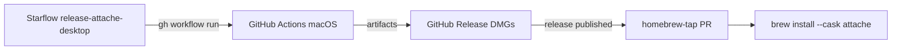

# VS-7 — Standalone packaging & distribution

**Status:** in progress (pipeline scaffold)  
**ADR:** [010](../adr/010-release-pipeline-starflow.md)  
**Mesh:** deferred ([backlog](../backlog.md))

## Goal

Ship Attache as an installable macOS app + Homebrew, without mesh or Celestial runtime deps.

## Architecture (Celestial precedent)



## Phases

### Phase 1 — CLI via Homebrew (fastest dogfood)

| Item | Status |
|------|--------|
| `pnpm build` produces `attache` + `attache-mcp` bins | ✅ exists |
| `Formula/attache.rb` in `dasysad/homebrew-tap` | ⏸️ |
| Starflow `release-attache-cli` (tag `v*` → tarball sha) | ⏸️ |
| `brew install dasysad/tap/attache` | ⏸️ |

No DMG — developers get CLI + MCP; run `attache` / `pnpm ss:up` for web.

### Phase 2 — Desktop DMG + Cask

| Item | Status |
|------|--------|
| `packages/attache-desktop` (Tauri 2) | ⏸️ |
| `.github/workflows/build-attache-desktop.yml` | ✅ scaffold |
| `starflow.yaml` → `release-attache-desktop` | ✅ scaffold |
| `Casks/attache.rb` + bump workflow | ✅ scaffold |
| `brew install --cask attache` | ⏸️ |

Tauri loads embedded server or spawns `attache-server` on loopback.

### Phase 3 — Polish

- Apple Developer ID + notarization (optional)
- R2 mirror + Tauri auto-updater
- Linux `.deb` / Windows (backlog)

## Starflow usage

```bash
# From attache repo (with gh auth + sf on PATH)
sf run release-attache-desktop --input version=desktop-v0.1.0
```

Requires `starflow.yaml` checkout pointing at `dasysad/attache` when run from entmoot mirror.

## GitHub secrets

| Secret | Purpose |
|--------|---------|
| `GITHUB_TOKEN` | default — workflow dispatch |
| `HOMEBREW_TAP_TOKEN` | PR write on `dasysad/homebrew-tap` |
| `CLOUDFLARE_R2_*` | optional DMG CDN (Phase 3) |
| `APPLE_*` | optional signing (Phase 3) |

## Tag conventions

| Stream | Example | Artifact |
|--------|---------|----------|
| Desktop | `desktop-v0.1.0` | DMG + Cask |
| CLI | `v0.1.0` | Formula tarball |

## Anything else? (checklist)

1. **`dasysad/homebrew-tap` repo** — public tap (Formula + Cask)
2. **Tauri desktop package** — shell + spawn server + menu bar optional
3. **Native deps** — `better-sqlite3` per-arch in bundle; document Node 22 runtime
4. **First-run / data dir** — `~/.attache/` created on launch; onboard wizard in shell
5. **MCP install hint** — ship `mcp.example.json` in app Resources; post-install message
6. **Extract sidecar** — v0: optional Python not bundled; env `ATTACHE_EXTRACT_URL` or in-process
7. **Code signing docs** — ad-hoc + `xattr -cr` quarantine note (copy Celestial README)
8. **Version bump discipline** — `tauri.conf.json` + root `package.json` before `sf run`
9. **CI on PR** — `pnpm test` + `pnpm build` (no DMG on every PR)
10. **Release notes template** — breaking changes, GCP redirect URI for Gmail loopback
11. **Auto-update** — defer; manual `brew upgrade --cask attache` first
12. **Privacy / license** — LICENSE file + tap cask `license` stanza

## Not in scope (v0 package)

- Mesh / multi-device sync
- Starsystem bundled for end users
- Linux/Windows installers

## Next implementation step

Build **Phase 1 Formula** + **`packages/attache-desktop` skeleton** in parallel.
